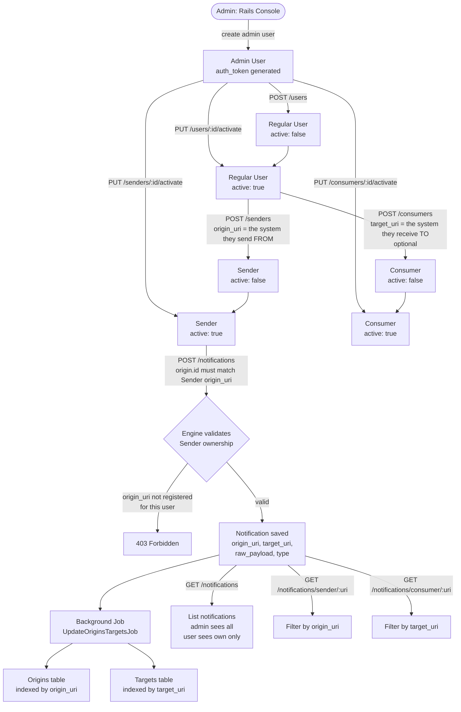

# How the COAR Notify inbox works

A REST API-only Rails engine that receives, stores, and serves COAR Notify notifications. There is no UI — everything is done via HTTP API calls using a Bearer token.

---

## Flow Diagram

---

## Step-by-Step

| Step | Who   | Action                              | Notes                                                        |
| ---- | ----- | ----------------------------------- | ------------------------------------------------------------ |
| 1    | Admin | Create admin user via Rails console | Only way to bootstrap the first user                         |
| 2    | Admin | `POST /users`                       | Creates a regular user, starts inactive (or pass active:true if created by admin) |
| 3    | Admin | `PUT /users/:id/activate`           | User must be active before they can do anything              |
| 4    | User  | `POST /senders`                     | Registers the system they will send notifications FROM (`origin_uri`) |
| 5    | Admin | `PUT /senders/:id/activate`         | Users cannot activate their own sender                       |
| 6    | User  | `POST /notifications`               | The `origin.id` in the payload must match the registered `origin_uri` |

---

## Key Concepts

**Origin URI** — the URL that identifies the system *sending* the notification (e.g. a preprint repository). Registered on the Sender.

**Target URI** — the URL that identifies the system *receiving* the notification (e.g. a review service). Stored on the notification as-is.

**Sender** — a registration that proves a user is authorised to send notifications on behalf of a given `origin_uri`. Required before posting any notification.

**Consumer** — a registration that proves a user is authorised to receive notifications on behalf of a given `target_uri`. Required before querying notifications filtered by target.

**NotificationType** — auto-created from the `type` field in the notification payload (e.g. `"Offer"`). No manual setup needed.

---

## Authorization Rules

- Every request requires `Authorization: Bearer <token>`.
- **Only admin** can activate users, senders, and consumers.
- **Only admin** can see all data — regular users only see records belonging to their own `username`.
- Non-admins are always forced `active: false` on create, regardless of what they send.
- The notification `origin.id` must match a Sender registered to the authenticated user, otherwise the request is rejected with `403 Forbidden`.

---

## What Happens in the Background

When a Sender or Consumer is created or updated, a background job (`UpdateOriginsTargetsJob`) runs asynchronously to maintain two index tables:

- **Origins table** — one row per unique `origin_uri`, storing which sender/consumer IDs are associated with it.
- **Targets table** — one row per unique `target_uri`, storing which sender/consumer IDs are associated with it.

These are used for lookups and reporting. They do not gate access — access control is handled directly on the Sender model.